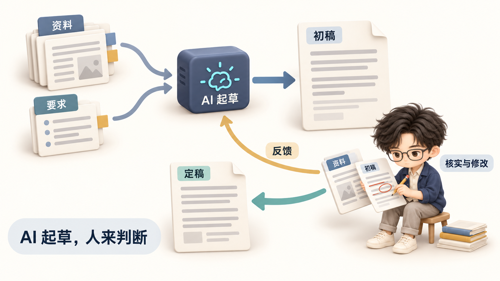
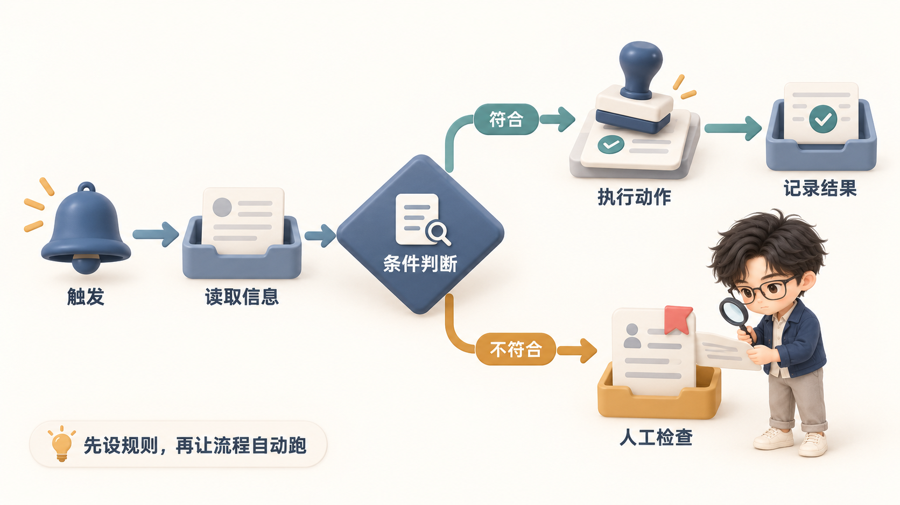

# 物件演示案例

以下三张为用户选定的正文图解参考。按当前知识点选择最接近的案例查看，不必一次加载全部图片。它们用于校准物件质感、知识关系与人物动作，不取代人物身份参考，也不是必须复制的固定版式。

## 01｜AI 写文章：反馈回路

- 适用：人机分工、修改迭代、输入与反馈。
- 参考：资料与要求汇入处理模块，初稿进入人工核实，反馈回到起草环节；人物用笔核对资料和初稿。
- 边界：定稿代表人的选择，不表示内容已经客观正确。资料页与处理模块是概念物件，不是真实软件界面。
- 调整：新图应把初稿到核实的关系表达清楚；人物尺度按正文信息主次重排，不照搬坐姿和纸页数量。

## 02｜知识库整理：分类与检索

- 适用：知识整理、资料组织、针对问题提取信息。
- 参考：散乱输入与分栏整理器形成对照；问题驱动检索，选中的笔记用于判断；人物把概念笔记放入对应栏。
- 边界：「概念、方法、案例」是示例分类，不是唯一分类体系；检索到笔记不等于其可靠或适用。
- 调整：图中小字用于具体说明，手机阅读时可减少；不要因参考用了文件整理器就把所有知识系统都画成柜子。

## 03｜自动化流程：条件分支

- 适用：条件判断、工作流、异常处理、人工检查点。
- 参考：触发、读取与条件节点职责分明；两条路径分开，颜色和短标签共同区分；人物检查异常记录。
- 边界：不符合条件进入人工检查，是本案例选择的处理方案；具体流程也可能停止、忽略或重试，应服从原文。
- 调整：判断节点仅用于确有条件分支的内容；普通步骤不要为了丰富画面添加分支。

## 共用参考规则

- 物件统一哑光立体、圆润边缘、低饱和蓝灰与奶油色、柔和接触阴影；对象职责通过不同外形、动作和标签区分。
- 丰富度来自关系、状态和有意义的细节，避免增加无关书堆、灯泡、景观或纹理。
- 人物身份、衣着和头身比以人物标准为准；角色不能遮挡对象或关系，大小按新图重排。
- 标准是让读者看懂当前知识点；不用复制案例的纸页、三分栏、坐姿、放大镜或提示语。
- 三张原始参考由内置 image_gen 生成，并由用户明确要求纳入参考库；这不代表每处细节都成为通用设计约束。
